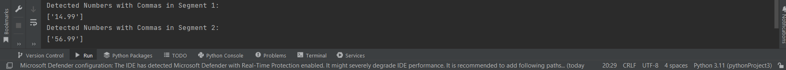

# pricetag-detection
# Price Detection System using OpenCV and Pytesseract

## Description
This is a price detection system implemented using OpenCV and Pytesseract. The system is designed to automatically extract and recognize prices from images containing textual information, such as product labels, receipts, or other similar documents. It can be used in various applications, including inventory management, expense tracking, and retail analysis.

## Installation

Before using the system, ensure you have the following requirements installed:

- Python 3.x
- OpenCV
- Pytesseract
- Tesseract OCR engine

You can install the required Python libraries using pip:

```bash
pip install opencv-python
pip install pytesseract
```

For Tesseract OCR, you need to install it separately based on your operating system. You can find the installation instructions for Tesseract OCR at https://github.com/tesseract-ocr/tesseract.

## Usage

1. Clone this repository to your local machine.

```bash
git clone https://github.com/Nafsal001/pricetag-detection.git
```

2. Place the images you want to process in the appropriate folder (e.g., `images/`).

3. Run the `price_detection.py` script.

```bash
python price_detection.py
```

4. The script will process the images, extract the price information, and display the results.

## Before and After Images

Below are examples of the input (before) and output (after) images processed by the price detection system.

### Input Image:


### Output Screenshot:



## Notes

- The accuracy of the price detection system may vary based on the quality and clarity of the input images.
- To improve accuracy, consider preprocessing the images (e.g., resizing, noise reduction) before passing them to the system.
- Adjusting the thresholding parameters and image processing techniques may be necessary for different types of input documents.

## Contributing

Contributions to this price detection system are welcome! If you find any issues or have suggestions for improvements, please submit an issue or pull request on the GitHub repository.

## License

This price detection system is open-source and available under the [MIT License](LICENSE).

## Acknowledgments

We would like to thank the developers of OpenCV, Pytesseract, and Tesseract OCR for their excellent libraries and tools.

---

